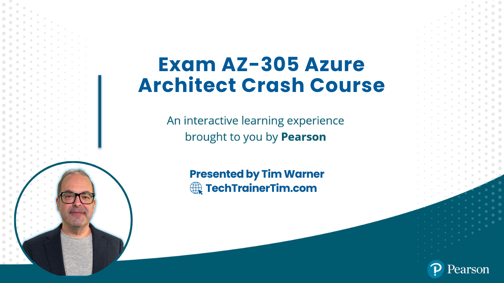

# Tim's AZ-305 Certification Study Resources



Welcome to the ultimate resource hub for preparing for the **AZ-305 Microsoft Azure Solutions Architect Exam**. Whether you're aiming for certification or deepening your Azure knowledge, this guide is packed with the best tools, links, and tips to set you up for success.

---

## 📬 **Contact Information**

- **[Email](mailto:tim@techtrainertim.com)**
- **[LinkedIn](https://www.linkedin.com/in/timothywarner316/)**
- **[YouTube Channel](https://www.youtube.com/channel/UCim7PFtynyPuzMHtbNyYOXA)**
- **[Website](https://techtrainertim.com)**
- **[Bluesky](https://bsky.app/profile/techtrainertim.bsky.social)**
- **[Mastodon](https://mastodon.social/@techtrainertim)**

[](https://techtrainertim.com)
[](https://github.com/timothywarner)

---

## 🚀 **The Good Stuff: Must-Have AZ-305 Resources**

- [AZ-305 Exam Page](https://learn.microsoft.com/en-us/learn/certifications/exams/az-305)
- [AZ-305 Skills Measured](https://learn.microsoft.com/en-us/credentials/certifications/resources/study-guides/az-305)
- [Exam Registration (Microsoft/Pearson VUE)](https://learn.microsoft.com/en-us/credentials/certifications/schedule-through-pearson-vue?examUid=exam.AZ-305&examUrl=https%3A%2F%2Flearn.microsoft.com%2Fcredentials%2Fcertifications)
- [MeasureUp AZ-305 Practice Exams](https://www.measureup.com/az-305-microsoft-azure-solutions-architect-expert-practice-test.html)
- [Microsoft Learn AZ-305 Learning Path](https://learn.microsoft.com/en-us/training/courses/az-305t00/)
- [Azure Free Account Signup](https://azure.microsoft.com/en-us/free/)
- [Pearson CertPREP AZ-305 Training Labs](https://www.pearsonvue.com/microsoft/exam-details)

---

## 📘 **Conceptual Knowledge**

These resources build your understanding of Azure fundamentals and exam concepts:

- [Azure Documentation](https://learn.microsoft.com/en-us/azure/)
- [Azure Architecture Center](https://learn.microsoft.com/en-us/azure/architecture/)
- [Azure Quickstart Templates](https://azure.microsoft.com/en-us/resources/templates/)
- [Azure SDKs and Tools](https://azure.microsoft.com/en-us/downloads/)
- [Sam Cogan ARM Tutorial](https://www.youtube.com/watch?v=9EpBiud48Ao&t=1s)
- [Adam Marczak ARM Tutorials](https://www.youtube.com/watch?v=Ge_Sp-1lWZ4&t=916s)
- [Azure Bicep Overview](https://learn.microsoft.com/en-us/azure/azure-resource-manager/bicep/overview)
- [AZ-305 Class Topology](https://lucid.app/lucidchart/5b4214cf-b00b-400d-80ff-c15572f57904/view?page=0_0#)

---

## 🛠 **Your Toolkit**

Essential tools to follow along and practice efficiently:

- **[Visual Studio Code](https://code.visualstudio.com/)**
  Recommended extensions:
  - [GitHub Pull Requests and Issues](https://marketplace.visualstudio.com/items?itemName=GitHub.vscode-pull-request-github)
  - [GitHub Copilot](https://marketplace.visualstudio.com/items?itemName=GitHub.copilot)
  - [GitHub Copilot Chat](https://marketplace.visualstudio.com/items?itemName=GitHub.copilot-chat)
  - [GitHub YAML](https://marketplace.visualstudio.com/items?itemName=redhat.vscode-yaml)
  - [Remote Repositories](https://marketplace.visualstudio.com/items?itemName=GitHub.remotehub)
  - [PowerShell](https://marketplace.visualstudio.com/items?itemName=ms-vscode.PowerShell)
  - [Azure Resources](https://marketplace.visualstudio.com/items?itemName=ms-vscode.vscode-node-azure-pack)
    - [Azure Account](https://marketplace.visualstudio.com/items?itemName=ms-vscode.azure-account)
    - [Azure CLI Tools](https://marketplace.visualstudio.com/items?itemName=ms-vscode.azurecli)
    - [Azure Resource Manager (ARM) Tools](https://marketplace.visualstudio.com/items?itemName=msazurermtools.azurerm-vscode-tools)
    - [Bicep](https://marketplace.visualstudio.com/items?itemName=ms-azuretools.vscode-bicep)
    - [Azure Policy](https://marketplace.visualstudio.com/items?itemName=ms-azuretools.vscode-azurepolicy)
    - [Azure Resource Manager Snippets](https://marketplace.visualstudio.com/items?itemName=ms-azuretools.vscode-azurearm-snippets)
- [Git](https://git-scm.com/downloads)
- [GitHub CLI](https://cli.github.com/)
- [PowerShell 7](https://learn.microsoft.com/en-us/powershell/scripting/install/installing-powershell)
- [Azure PowerShell Module](https://learn.microsoft.com/en-us/powershell/azure/install-az-ps)
- [Azure CLI](https://learn.microsoft.com/en-us/cli/azure/install-azure-cli)
- [Azure Developer CLI (AZD)](https://learn.microsoft.com/en-us/azure/developer/azure-developer-cli/install-azd)
- [Azure Storage Explorer](https://azure.microsoft.com/en-us/features/storage-explorer/)
- [AzCopy](https://learn.microsoft.com/en-us/azure/storage/common/storage-use-azcopy-v10)

---

## 🛡 **Practical Application**

Learn through hands-on labs and live environments:

- [Azure Free Account](https://azure.microsoft.com/en-us/free/trial/)
- [Microsoft Learn: Solutions Architect Path](https://learn.microsoft.com/en-us/learn/browse/?roles=solution-architect)
- [Azure Citadel](https://azurecitadel.com/)
- [AZ-305 Microsoft Official Curriculum Labs](https://github.com/MicrosoftLearning/AZ-305-DesigningMicrosoftAzureInfrastructureSolutions)
- [Azure Bicep Playground](https://bicepdemo.z22.web.core.windows.net/)
- [Azure Log Analytics Demo Environment](https://portal.azure.com/#blade/Microsoft_Azure_Monitoring/LogsDemoBlade)

---

## 📑 **Practice Exams**

- [Microsoft Free Practice Assessments](https://learn.microsoft.com/en-us/certifications/practice-assessments-for-microsoft-certifications)
- [MeasureUp Practice Exams](https://www.measureup.com/az-305-microsoft-azure-solutions-architect-expert-practice-test.html)
- [Whizlabs AZ-305 Practice Exams](https://www.whizlabs.com/designing-microsoft-azure-infrastructure-solutions-az-305/)
- [Udemy AZ-305 Practice Questions](https://www.udemy.com/course/az-305-microsoft-azure-solutions-architect-expert-practice-test/)

---

## 💸 **Exam Discounts and Registration Info**

- [Microsoft Certification Special Offers](https://learn.microsoft.com/en-us/certifications/deals)
- [AZ-305 Exam Registration](https://learn.microsoft.com/en-us/credentials/certifications/exams/az-305)
- [About Online Exams](https://learn.microsoft.com/en-us/credentials/certifications/online-exams)
- [Certification Policies and FAQs](https://learn.microsoft.com/en-us/credentials/certifications/certification-exam-policies)
- [Microsoft Certification Exam Policies](https://learn.microsoft.com/en-us/certifications/certification-exam-policies)

---

## 🎥 **Tim's Helper Videos**

- [Exam Registration Walkthrough](https://www.youtube.com/watch?v=FOFWbSYbbVI)
- [Online Testing Tips](https://www.youtube.com/watch?v=myf6r5nulj0&feature=youtu.be)

---

This README is designed for maximum utility and easy navigation. If you have suggestions or corrections, feel free to reach out via the contact information above. Best of luck on your AZ-305 journey!

# Architecture Diagram Downloader

This script downloads architecture diagrams from Microsoft Learn pages for the AZ-305 course.

## Prerequisites

- Python 3.6 or higher
- pip (Python package installer)

## Installation

1. Clone this repository or download the files
2. Install the required dependencies:

```bash
pip install -r requirements.txt
```

## Usage

Run the script with:

```bash
python download_diagrams.py
```

The script will:

1. Create an `images` directory if it doesn't exist
2. Download architecture diagrams from the specified Microsoft Learn pages
3. Save the images with descriptive filenames based on the page name and image index

## Notes

- The script includes a 1-second delay between requests to be respectful to the servers
- Images are filtered to include only those with 'architecture', 'diagram', or 'reference' in their URLs
- The script handles both regular images and SVG diagrams
